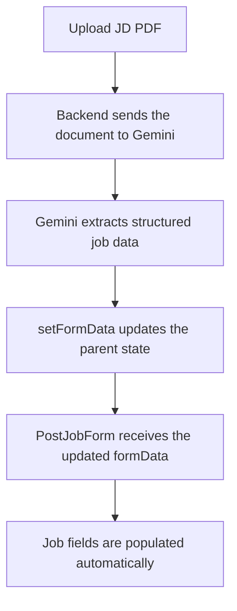
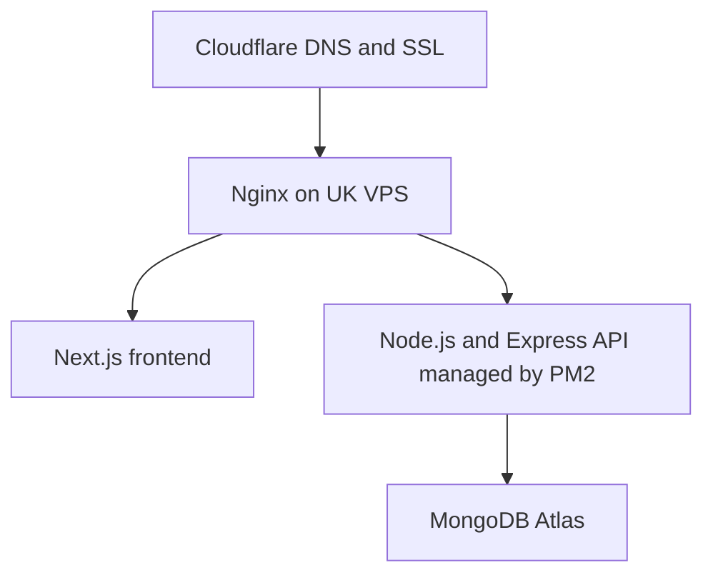

# SkillfulJobs.ai

SkillfulJobs.ai is an AI-powered recruitment platform for candidates and companies.

Candidates can upload and analyse their CVs, discover matching jobs, apply for roles, and monitor their applications. Companies can post vacancies, review applicants, compare skills, and shortlist suitable candidates using AI-supported matching insights.

> **Project status:** Active development  
> **Current focus:** Regression testing after the Company ownership migration, company-side application-status flow, final job-search/filter verification, and planning candidate-side auto-refresh when new jobs are posted.

---

## Main Users

### Candidates

- Create and verify an account using an email OTP.
- Upload and store a CV securely in PDF format.
- Extract skills, education, qualifications, and experience from the CV.
- Receive AI-generated CV insights and improvement suggestions.
- Set **Available for Work** status.
- Discover jobs that match skills and location.
- Search and filter jobs by keyword, location, salary, and work mode.
- Apply for jobs and monitor application statuses.
- Keep already-applied jobs visible while showing the current application status.
- Be excluded from recruiter recommendations when **Available for Work** is turned off.

### Companies and Recruiters

- Create and verify a company account.
- Create a Company record during the first company signup.
- Support multiple company users through the same `User.companyId`.
- Use company roles such as:
  - `company_admin`
  - `recruiter`
  - `hiring_manager`
- Post and manage job vacancies.
- Upload a job-description PDF to prefill the job-posting form.
- Review applicants and recommended candidates.
- View match scores, matched skills, missing skills, and location matches.
- Update application statuses.
- Track vacancies and filled positions.
- Share company-level application history between authorised users of the same company.
- Exclude candidates who are not available for work or who have already been accepted elsewhere.

### Super Admin

Super Admin functionality is planned for a later phase.

Planned responsibilities include:

- Manage candidate and company accounts.
- Review and manage job posts.
- View platform activity and reports.
- Review subscription and usage status.
- Support role-based administrative access.

---

## Core Platform Features

- Candidate and company role-based access
- JWT authentication and OTP email verification
- Password reset flow
- Guest and registered-candidate CV uploads
- PDF CV and job-description processing
- AI-powered skill extraction and CV analysis
- Candidate-to-job matching
- Job-to-candidate recommendations
- Application tracking and status management
- Duplicate application prevention
- Candidate **Available for Work** controls
- Accepted-candidate exclusion rules
- Vacancy and filled-position tracking
- Candidate and company email notifications
- Stripe payment/subscription integration work
- Responsive Next.js and Tailwind CSS interface

---

## Current Company Architecture

The project now uses a separate `Company` model instead of treating every company user as an independent company.

### Relationship

```text
User
 └── companyId -> Company._id

Company
 ├── createdBy -> User._id
 └── company users share the same Company._id

Job
 ├── companyId -> Company._id
 └── createdBy -> User._id

Application
 ├── candidateId -> numeric User.userId
 ├── companyId -> Company._id
 └── jobId -> Job._id
```

### Current behaviour

- The first company signup creates:
  1. the User,
  2. the Company,
  3. `Company.createdBy = User._id`,
  4. `User.companyId = Company._id`,
  5. `User.companyRole = "company_admin"`.

- Company-level access is based on `User.companyId`, not an individual recruiter user ID.
- `Job.companyId` references the Company.
- `Job.createdBy` records the recruiter who created the job.
- New application emails are sent to the recruiter stored in `Job.createdBy`.
- `Application.companyId` now references the Company.
- Existing `candidateId` values remain numeric `User.userId` values for now.

### Verified

Multi-user company access has been tested by assigning the same `companyId` to two company users and confirming that both users can access the same company application history.

---

## Location Rules

Company location and Job location are intentionally separate.

- **Company location** describes where the company is based.
- **Job location** describes where the role is based.
- Job search and candidate matching use **Job.location**, not Company.location.
- Matching supports same-country logic and UK naming variations.

---

## Job Search

### Latest Jobs

Current intended behaviour:

- Newest jobs first.
- Only Open and non-expired jobs.
- Recent jobs, for example the latest 14 days.
- Applied jobs remain visible.
- The Apply button changes to the current application status.

Current filters include:

- Keyword
- Location
- Salary
- Work mode

Final verification and refinement are still in progress.

### All Jobs

All Jobs is intended to be the main job-search page.

It should:

- Show all currently available jobs.
- Keep applied jobs visible.
- Show the candidate's application status where applicable.
- Support search/filtering by:
  - Keyword
  - Location
  - Category
  - Salary
  - Work mode

---

## Candidate-Side Auto-Refresh Requirement

**Confirmed product requirement — implementation pending.**

When a company successfully posts a new **Open** job:

1. Candidate-side **Latest Jobs** should refresh/update automatically.
2. Candidate-side **All Jobs** should refresh/update automatically.
3. Relevant candidate **job recommendations** should refresh/recalculate where required.
4. Eligible candidates should see the new job without manually refreshing the browser.
5. Closed or expired jobs must still be excluded from available-job results.

The product behaviour is confirmed.

The technical implementation still needs to be selected. Possible approaches include:

- periodic re-fetching / polling,
- Server-Sent Events,
- WebSockets,
- another event-driven approach.

---

## Candidate Matching

Current matching uses job requirements and candidate data.

Matching information includes:

- Overall match score
- Matched skills
- Missing skills
- Location match

Current rules include:

- Job skills are the main matching factor.
- Location contributes to the match.
- Candidates with `availableForWork: false` should not appear in recruiter recommendations.
- Candidates already accepted elsewhere should not appear as available recommendations.
- Candidates who already applied to the same job should not appear as fresh recommendations for that job.

### Planned Matching Refresh

- When a company creates or meaningfully updates a job, candidate recommendations should refresh/recalculate.
- When a candidate uploads or updates a CV, relevant company recommendation results should refresh/recalculate.

---

## Application and Vacancy Rules

Current application behaviour includes:

- Candidates can apply to Open jobs.
- Duplicate applications are blocked.
- Applied jobs remain visible to the candidate.
- Application statuses include:

```text
pending
reviewing
interview
accepted
rejected
```

Candidate-facing labels can display these as:

```text
Application Submitted
Application Under Review
Interview Stage
Application Accepted
Application Unsuccessful
```

### Acceptance rules

- A candidate should not be accepted for multiple jobs at the same time.
- When an application changes to `accepted`, the job's `filledPositions` is incremented.
- A job closes only when:

```text
filledPositions >= vacancies
```

- Applications should not be deleted simply because the candidate was accepted.
- Accepted candidates should be excluded from other recruiter recommendation results.

---

## Candidate Privacy Direction

**Planned feature.**

Recruiters should not automatically receive the candidate's original CV with direct contact information.

The recruiter-facing CV/profile should hide or remove:

- Email address
- Phone number
- Full home address
- Direct contact links
- Other contact information that would allow the recruiter to bypass the platform

The original CV should remain private.

Recruiters should communicate with candidates through SkillfulJobs.ai.

A future workflow may allow:

```text
Recruiter -> Request Contact Details
Candidate -> Accept / Decline
```

Contact details should only be released according to the agreed privacy/contact-sharing rules.

The backend API should also avoid returning hidden private fields to recruiters. This must not rely only on frontend CSS or display logic.

---

## Candidate Premium Value Ideas

The candidate paid plan should provide value beyond simply allowing more applications.

Planned ideas include:

### AI Application Pack

For a selected job:

- CV improvement suggestions
- Matched and missing skills
- Job-specific CV optimisation guidance
- Tailored cover-letter assistance
- Job-specific interview questions

### Advanced Candidate Tools

- Detailed match explanation
- Best Jobs for Me
- Strong-match job alerts
- Interview preparation
- Skill-gap analysis
- Application insights
- Future salary/market insights

Basic candidate privacy should **not** be a paid feature.

Candidate/recruiter messaging should also be carefully designed so that a paying recruiter is not blocked from communicating with a suitable candidate just because that candidate is on a free plan.

---

## Job-Description Upload Flow



---

## Technology Stack

| Area | Technology |
| --- | --- |
| Frontend | Next.js, React, Tailwind CSS, Framer Motion, React Icons |
| Backend | Node.js, Express.js |
| Database | MongoDB, Mongoose |
| Authentication | JWT, email OTP, Nodemailer |
| AI processing | Google Gemini API |
| Payments | Stripe |
| File processing | PDF CV and job-description uploads |
| Planned production setup | UK VPS, CloudPanel, Nginx, PM2, MongoDB Atlas, Cloudflare |

---

## Getting Started

### Prerequisites

- Node.js and npm
- MongoDB or a MongoDB Atlas database
- A Google Gemini API key
- Email credentials for sending OTPs and notifications
- Stripe test credentials for payment/subscription testing

### Installation

Install dependencies separately inside the frontend and backend directories:

```bash
npm install
```

Start each application from its respective directory:

```bash
npm run dev
```

The local development environment currently uses:

- Frontend: `http://localhost:3000`
- Backend: `http://localhost:8002`

Create the required environment files and provide the values referenced by the project, including:

```env
MONGO_URI=
JWT_SECRET=
GEMINI_API_KEY=
EMAIL_USER=
EMAIL_PASS=
STRIPE_SECRET_KEY=
```

Never commit API keys, passwords, or other secrets to Git.

---

## Completed Work

### General

- [x] Test footer links and confirm that they work.
- [x] Create static pages, including Terms and Conditions.
- [x] Select Stripe as the payment provider.
- [x] Create candidate/company authentication with OTP verification.
- [x] Implement password reset/email verification flow.

### Candidate

- [x] Candidate registration and login.
- [x] PDF CV upload.
- [x] CV skill extraction.
- [x] Candidate job matching.
- [x] Candidate application tracking.
- [x] Add **Available for Work** to candidate profiles.
- [x] Exclude unavailable candidates from recruiter recommendations.
- [x] Block duplicate applications.
- [x] Keep applied jobs visible while displaying application status.

### Company / Recruiter

- [x] Create separate Company model.
- [x] Link company users using `User.companyId -> Company._id`.
- [x] Add company roles: `company_admin`, `recruiter`, `hiring_manager`.
- [x] Migrate `Job.companyId` to `Company._id`.
- [x] Add `Job.createdBy -> User._id`.
- [x] Migrate `Application.companyId` to `Company._id`.
- [x] Migrate JobController to Company ownership.
- [x] Migrate ApplicationController to Company ownership.
- [x] Verify shared company application history between users with the same `companyId`.
- [x] Create, edit, and delete jobs.
- [x] Review applicants and recommended candidates.
- [x] Update vacancy / filled-position logic.
- [x] Close jobs only when `filledPositions >= vacancies`.
- [x] Route new application email to the recruiter in `Job.createdBy`.
- [x] Exclude accepted candidates from other recommendations.

---

## Current Development / Regression Focus

- [ ] Re-test the complete Company -> Job -> Application flow after the ownership migration.
- [ ] Re-test company-side application-status updates.
- [ ] Verify Job route ordering so static routes such as `/recommended-candidates` are not captured by generic `/:id` routes.
- [ ] Finish regression testing for Latest Jobs filters.
- [ ] Finish regression testing for All Jobs filters.
- [ ] Confirm category/relevance sorting behaviour.
- [ ] Implement candidate-side automatic refresh when a new Open job is posted.

---

## Subscription and Usage Policy

### Current Pricing Direction

#### Candidate

| Plan | Price | Allowance |
| --- | ---: | --- |
| Free | £0 | 3 job applications |
| Premium Monthly | £7.99/month | Unlimited applications |
| Premium Yearly | £69.99/year | Unlimited applications |

#### Company

| Plan | Price | Allowance |
| --- | ---: | --- |
| Single Job | £8/job | 1 job post |
| Starter | £49/month | Up to 10 posts/month |
| Growth | £100/month | Up to 30 posts/month |
| Unlimited | £500/year | Unlimited posts |

Pricing is still introductory and may change before launch.

### Confirmed Product Behaviour

- New users receive an initial 15-day free-access period.
- User data, CVs, jobs, and applications must not be deleted automatically when free access or a subscription ends.
- Restricted actions should be blocked when the user does not have a valid allowance.
- **Apply Now** should be disabled for restricted candidates.
- **Post Job** should be disabled for restricted companies.
- The backend must validate access before every protected action.
- Frontend button disabling alone is not enough protection.
- A scheduled task can support subscription/usage reconciliation, but API validation remains required.

### Subscription Implementation Status

The full entitlement/usage-enforcement layer is **planned / not yet complete**.

### Decisions Still Required

- [ ] Confirm exactly how the 15-day trial works with the Candidate Free plan's 3 applications.
- [ ] Define the company trial job-post allowance.
- [ ] Confirm whether the Free candidate's 3 applications are lifetime or reset.
- [ ] Confirm successful monthly-renewal counter reset behaviour.
- [ ] Define failed-payment behaviour.
- [ ] Confirm cancelled-subscription access until end of billing period.
- [ ] Decide whether CV analysis has a separate AI usage allowance.
- [ ] Decide whether premium AI tools need a monthly fair-use allowance.

---

## Development Backlog

### Candidate Side

- [ ] Implement candidate-side auto-refresh when a new Open job is posted.
- [ ] Complete/refine All Jobs filtering.
- [ ] Complete category and relevance sorting.
- [ ] Improve the Candidate Skills page.
- [ ] Build the sanitised recruiter-facing CV/profile.
- [ ] Add advanced candidate Premium tools.
- [ ] Add strong-match/new-job alerts.

### Company Side

- [ ] Add/refine CV/applicant listing filters.
- [ ] Improve filtering, navigation, and quick-access links.
- [ ] Add platform messaging.
- [ ] Add recruiter contact-detail request workflow if agreed.
- [ ] Implement subscription/job-posting entitlement enforcement.
- [ ] Add automatic matching refresh when candidate CV data changes.

### Matching / Real-Time Updates

- [ ] Recalculate relevant candidate matches after a new/updated job.
- [ ] Recalculate recruiter recommendations after a new/updated CV.
- [ ] Implement automatic candidate-side update after a newly posted Open job.

### Super Admin

- [ ] Add protected Super Admin login/access.
- [ ] Manage candidate/company users.
- [ ] Manage job listings.
- [ ] Add platform reports/overview.
- [ ] Add subscription/usage visibility.

### Error Handling and User Experience

- [ ] Handle Gemini DNS, timeout, authentication, quota, and service errors.
- [ ] Display clear user-friendly errors instead of a general `Server Error`.
- [ ] Decide whether failed CV analyses should retry automatically.
- [ ] Ensure an email-delivery failure does not make a successful job application appear unsuccessful.
- [ ] Improve loading, empty, success, and failure states.
- [ ] Continue mobile and cross-browser testing.

### Legal and Privacy

- [ ] Add a Privacy Policy aligned with UK GDPR requirements.
- [ ] Explain which account data, CV files, and extracted skills are stored.
- [ ] Define data-retention periods.
- [ ] Explain how users can request access to or deletion of their data.
- [ ] Add consent where required before processing uploaded CV information.
- [ ] Document third-party services such as Gemini, Stripe, email providers, and hosting.
- [ ] Implement sanitised recruiter-facing CVs so direct candidate contact details are not exposed.

---

## Open Product Questions

- [ ] Will the initial launch target UK users only or support multiple countries?
- [ ] What is the approximate Gemini cost of analysing one CV?
- [ ] What is the acceptable AI-processing cost per candidate or company account?
- [ ] Should failed AI requests retry automatically, and if so, how many times?
- [ ] How long should CVs, applications, jobs, and account records be retained?
- [ ] Which technical approach should be used for candidate-side job auto-refresh?
- [ ] When should candidate contact details be released to recruiters, if at all?

---

## Testing Priorities

- Authentication, OTP expiry, and role-based route protection
- Company ownership and multi-user company access
- Company-side application-status updates
- Job route-order regression testing
- Candidate and company access restrictions
- Duplicate application prevention
- Job vacancy and filled-position calculations
- Accepted-candidate exclusion rules
- Available-for-Work filtering
- Latest Jobs / All Jobs filters
- Candidate-side automatic update after a newly posted job
- CV and job-description PDF validation
- Gemini failure and retry behaviour
- Email failure handling
- Subscription renewal/cancellation/payment-failure behaviour
- Candidate contact-data privacy
- UK GDPR consent and data-deletion flows
- Mobile responsiveness and accessibility

---

## Production Architecture

The proposed production configuration is:



Planned production tooling:

- UK-based VPS
- CloudPanel
- Nginx
- PM2
- MongoDB Atlas
- Cloudflare DNS / SSL

The target discussed for initial hosting is approximately **£2-£3 per month**, subject to the final VPS/provider pricing.

---

## TypeScript Plan

The current application is being stabilised in JavaScript/JSX first.

After the major features and architecture are stable, the project can be migrated to TypeScript as a separate refactor/migration phase.

This keeps the current development work focused on:

- architecture,
- business logic,
- testing,
- debugging,
- production readiness,

before introducing a large language migration.

---

## Project Goal

The goal is to prepare SkillfulJobs.ai as a production-ready, portfolio-quality full-stack application that demonstrates:

- Full-stack architecture and REST API development
- Authentication and role-based authorisation
- Multi-user Company ownership architecture
- AI API integration and structured data extraction
- File upload and document processing
- Recruitment matching logic
- Candidate/job recommendation workflows
- Application and vacancy management
- Subscription and usage-limit planning/enforcement
- Privacy-aware recruiter/candidate workflows
- Error handling and testing
- Production deployment planning

---

Developed by **Fumika Mikami** as an AI-integrated full-stack development project.
