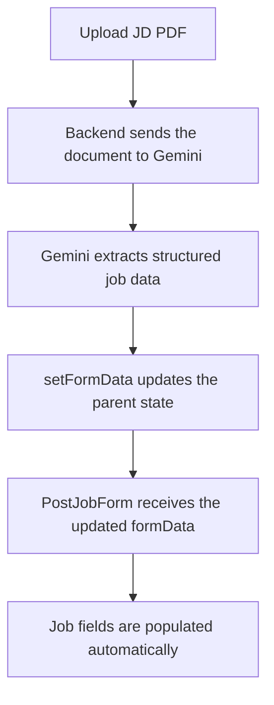
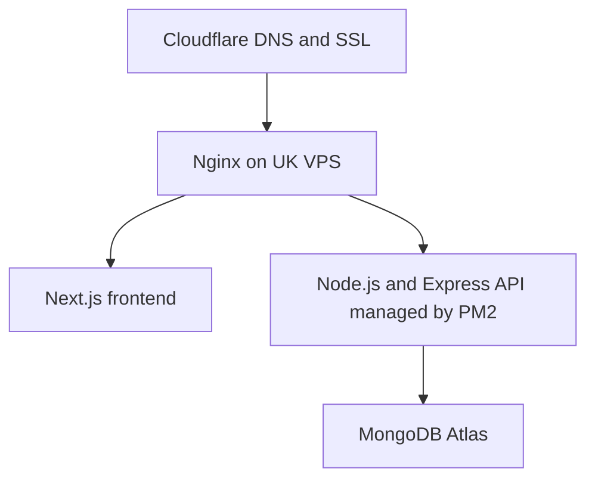

# SkillfulJobs.ai

SkillfulJobs.ai is an AI-powered recruitment platform for candidates and companies. Candidates can upload and analyse their CVs, discover matching jobs, apply for roles, and monitor their applications. Companies can post vacancies, review applicants, compare skills, and shortlist suitable candidates using AI-supported matching insights.

> **Project status:** Active development

## Main Users

### Candidates

- Create and verify an account using an email OTP.
- Upload a CV securely in PDF format.
- Extract skills, education, qualifications, and experience.
- Receive AI-generated CV insights and improvement suggestions.
- Discover jobs that match their skills and location.
- Apply for jobs and monitor application statuses.

### Companies and Recruiters

- Create and verify a company account.
- Post and manage job vacancies.
- Upload a job-description PDF to prefill the job-posting form.
- Review applicants and recommended candidates.
- View match scores, matched skills, missing skills, and location matches.
- Update application statuses and manage filled vacancies.

## Core Platform Features

- Candidate and company role-based access
- JWT authentication and OTP email verification
- Guest and registered-candidate CV uploads
- PDF CV and job-description processing
- AI-powered skill extraction and CV analysis
- Candidate-to-job matching
- Job-to-candidate recommendations
- Application tracking and status management
- Vacancy and filled-position tracking
- Candidate and company email notifications
- Stripe subscription integration
- Responsive Next.js and Tailwind CSS interface

## Technology Stack

| Area | Technology |
| --- | --- |
| Frontend | Next.js, React, Tailwind CSS, Framer Motion, React Icons |
| Backend | Node.js, Express.js |
| Database | MongoDB, Mongoose |
| Authentication | JWT, email OTP, Nodemailer |
| AI processing | Google Gemini API |
| Payments | Stripe |
| File processing | PDF CV and job-description uploads |
| Planned production setup | UK VPS, CloudPanel, Nginx, PM2, MongoDB Atlas, Cloudflare |

## Job-Description Upload Flow



## Getting Started

### Prerequisites

- Node.js and npm
- MongoDB or a MongoDB Atlas database
- A Google Gemini API key
- Email credentials for sending OTPs and notifications
- Stripe test credentials for subscription testing

### Installation

Install dependencies separately inside the frontend and backend directories:

```bash
npm install
```

Start each application from its respective directory:

```bash
npm run dev
```

The local development environment currently uses:

- Frontend: `http://localhost:3000`
- Backend: `http://localhost:8002`

Create the required environment files and provide the values referenced by the project, including:

```env
MONGO_URI=
JWT_SECRET=
GEMINI_API_KEY=
EMAIL_USER=
EMAIL_PASS=
STRIPE_SECRET_KEY=
```

Never commit API keys, passwords, or other secrets to Git.

## Completed Work

- [x] Test all footer links and confirm that they work.
- [x] Create static pages, including Terms and Conditions.
- [x] Select Stripe as the payment provider.
- [x] Confirm that SkillfulJobs.ai should have separate social-media accounts.

## Subscription and Usage Policy

### Confirmed Behaviour

- New users receive 15 days of free access to apply for or post jobs.
- User data, CVs, jobs, and applications must not be deleted automatically when free access or a subscription ends.
- When access expires, restricted actions must be blocked.
- The **Apply Now** button must be disabled for restricted candidates.
- The **Post Job** button must be disabled for restricted companies.
- Restrictions must also be validated by the backend; disabling a frontend button is not sufficient protection.
- Usage should reset after a successful subscription renewal.
- A scheduled task can reconcile subscription status and usage counts, while each protected action must still be validated when requested.

### Decisions Still Required

- [ ] Define the application allowance for every candidate plan.
- [ ] Define the job-posting allowance for every company plan.
- [ ] Decide whether CV analysis has a separate usage allowance.
- [ ] Decide how yearly-plan allowances are released: all at once or monthly.
- [ ] Decide what happens when a payment fails or a subscription expires.
- [ ] Confirm when a cancelled subscription loses access: immediately or at the end of the paid period.

## Development Backlog

### Company Side

- [ ] Show the latest CVs and applications first.
- [ ] Add filters to CV and applicant listings.
- [ ] Exclude candidates who have already accepted another job.
- [ ] Improve filtering, navigation, and quick-access links.
- [ ] Allow job posting only when the company's access is active and posting capacity remains.
- [ ] Verify that jobs close only when filled positions reach the vacancy limit.

### Candidate Side

- [ ] Add an **Available for work** option to candidate profiles.
- [ ] Update and improve the Candidate Skills page.
- [ ] Allow applications only when the candidate's access is active and application capacity remains.
- [ ] Do not count failed or incomplete application attempts against the allowance.
- [ ] Continue hiding jobs to which the candidate has already applied from recommendations.

### Error Handling and User Experience

- [ ] Handle Gemini DNS, timeout, authentication, quota, and service errors.
- [ ] Display clear, user-friendly messages instead of a general `Server Error`.
- [ ] Decide whether failed CV analyses should retry automatically.
- [ ] Ensure an email-delivery failure does not make a successful job application appear unsuccessful.
- [ ] Improve loading, empty, success, and failure states.

### Legal and Privacy

- [ ] Add a Privacy Policy aligned with UK GDPR requirements.
- [ ] Explain which account data, CV files, and extracted skills are stored.
- [ ] Define how long CVs, applications, and account data are retained.
- [ ] Explain how users can request access to or deletion of their data.
- [ ] Add consent where required before processing uploaded CV information.
- [ ] Document the use of third-party services such as Gemini, Stripe, email providers, and hosting services.

## Open Product Questions

- [ ] Will the initial launch target UK users only or support multiple countries?
- [ ] What is the approximate Gemini cost of analysing one CV?
- [ ] What is the acceptable AI-processing cost per candidate or company account?
- [ ] Should failed AI requests retry automatically, and if so, how many times?
- [ ] How long should CVs, applications, jobs, and account records be retained?

## Testing Priorities

- Authentication, OTP expiry, and role-based route protection
- Candidate and company access restrictions
- Application and job-posting usage limits
- Subscription renewal, cancellation, and payment-failure behaviour
- Duplicate application prevention
- Job vacancy and filled-position calculations
- Accepted-candidate exclusion rules
- CV and job-description PDF validation
- Gemini failure and retry behaviour
- Email failure handling
- UK GDPR consent and data-deletion flows
- Mobile responsiveness and accessibility

## Production Architecture

The proposed production configuration is:



CloudPanel will be used to manage the VPS, domains, SSL configuration, and server applications.

## Project Goal

The goal is to prepare SkillfulJobs.ai as a production-ready, portfolio-quality MERN application that demonstrates:

- Full-stack architecture and REST API development
- Authentication and role-based authorisation
- AI API integration and structured data extraction
- File upload and document processing
- Recruitment matching logic
- Subscription and usage-limit enforcement
- Error handling, testing, privacy, and deployment planning

---

Developed by **Fumika Mikami** as an AI-integrated full-stack development project.
