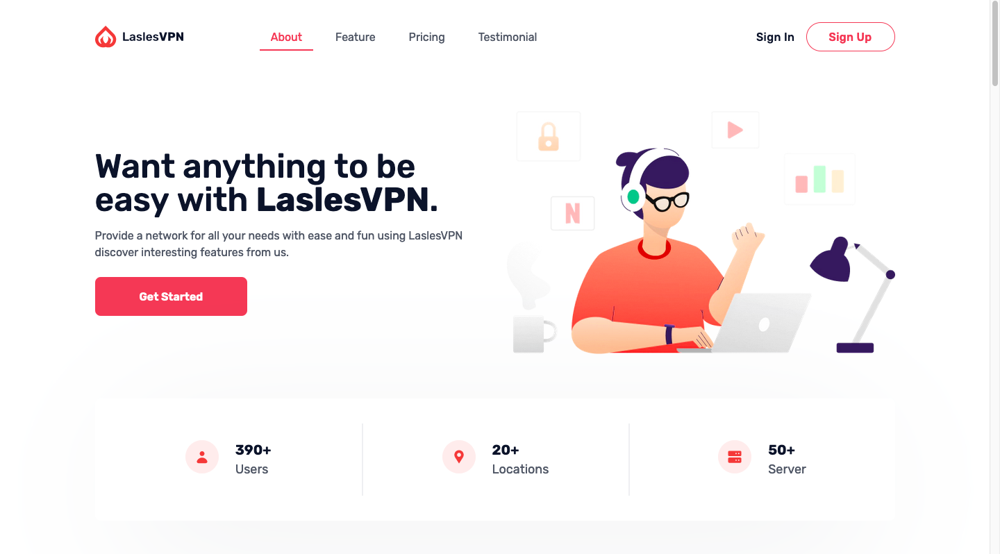

<!-- # [Tailwind VPN Landingpage](https://next-landing-vpn.vercel.app/) - Free Landingpage Template Apps

Tailwind VPN Landingpage is an open source, apps landing page template for [Tailwind CSS](https://tailwindcss.com/) and[ NextJS](nextjs.org/) coded by [Faldi](twitter.com/f2aldi) and design from [Didi](https://twitter.com/didiikurniawann).

## Getting Started

Choose one of the following options to get started:

- [Download the latest release](https://github.com/naufaldi/next-landing-vpn/archive/main.zip)
- Clone the repo: `git clone https://github.com/naufaldi/next-landing-vpn.git`
- Fork the repo

## About the Template

- Template building using NextJS Version 10
- Tailwind v2.0

## Feature Template

- Using [NextJS Image](https://nextjs.org/docs/api-reference/next/image) for Image Optimization
- Slider using [React Slick](https://react-slick.neostack.com/docs/api)
- Smooth Scrolling and Active menu using [React Scroll](https://www.npmjs.com/package/react-scroll)

## Bugs and Issues

Have a bug or an issue with this template? [Open a new issue](https://github.com/naufaldi/next-landing-vpn/issues/new) here on GitHub.

## Creator

[Tailwind VPN Landingpage](https://next-landing-vpn.vercel.app/) was coded and modified by and is maintained by **[me](https://github.com/naufaldi/)**, and dekstop design by [Didi Kurniawan](https://twitter.com/didiikurniawann)

## Copyright and License

Code released under the MIT license.

## To Do List Add Feature

- [ ] Animation using Framer Motion

 -->

Completed
	1. Test all footer links and confirm they work — Completed
	2. Create static pages such as Terms and Conditions — Completed
Questions for Tutor
	1. Social media links:
		○ Do we need to create separate social media accounts for SkillfulJobs.ai?
			>> YES
	2. Subscription usage rules:
		○ Define the number of job applications allowed for each candidate plan.
		○ Define the number of job posts allowed for each company plan.
		○ Track usage during the monthly or yearly billing period.
		○ Block actions when the allowance has been reached.
		○ Reset the allowance when the subscription renews.
		○ Decide what happens when a subscription expires or payment fails.
		
	3. Target market:
		○ Are we initially targeting UK customers only or customers from multiple countries?
		>> 
	4. Payment provider:
		○ Should we use Stripe or Wise? >>> Stripe
		
	5. Gemini API pricing:
		○ Calculate the approximate Gemini API cost for processing each CV.
		○ Decide whether CV analysis should have its own usage limit.
		
Company-Side Tasks
	1. Show the latest CVs and applications first on the company side.
	2. Add filters for company-side CV and applicant listings.
	3. Do not show candidates who have already been accepted for another job.
	4. Improve the page design for easier filtering and quicker navigation.
	5. Ensure companies can only post jobs when their plan is active and they have remaining posting capacity.
Candidate-Side Tasks
	1. Add an “Available for work” option to candidate profiles.
	2. Update and improve the Candidate Skills page.
	3. Ensure candidates can only apply when their plan is active and they have remaining application capacity.
	4. Do not count failed or incomplete application attempts against the candidate’s allowance.
Error Handling and User Experience
	1. Handle Gemini API errors such as DNS, timeout, invalid API key and usage-limit errors.
	2. Show user-friendly messages instead of a general “Server Error”.
	3. Decide whether failed CV analysis should be retried automatically.
	4. Ensure email delivery failures do not make a successful job application appear unsuccessful.
Legal and Privacy
	1. Add a Privacy Policy that complies with UK GDPR.
	2. Explain what candidate data, uploaded CVs and extracted skills are stored.
	3. Explain how long user data is retained and how users can request deletion.
	4. Add consent where required for processing uploaded CV information.
